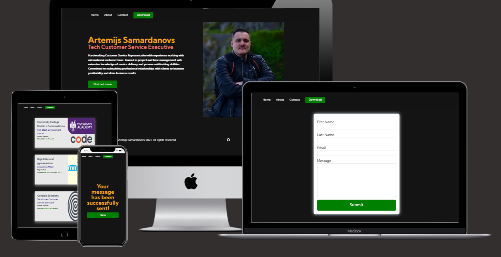
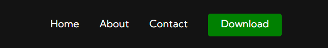
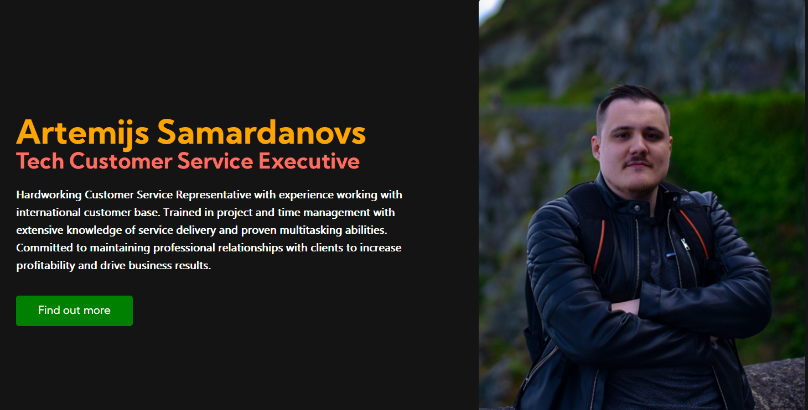
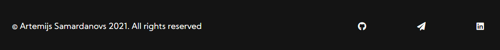
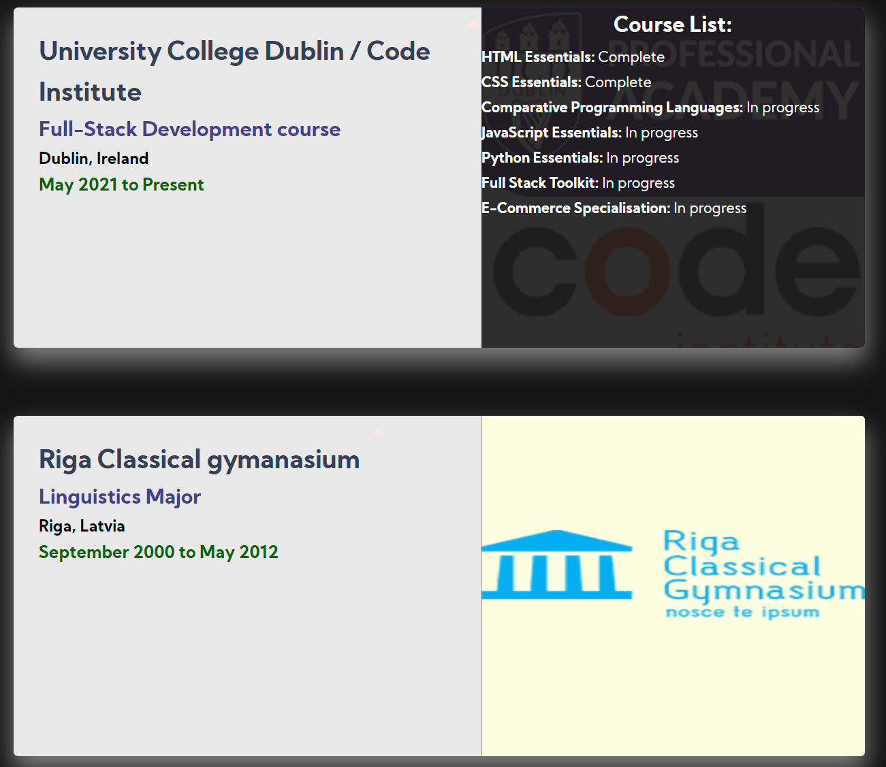
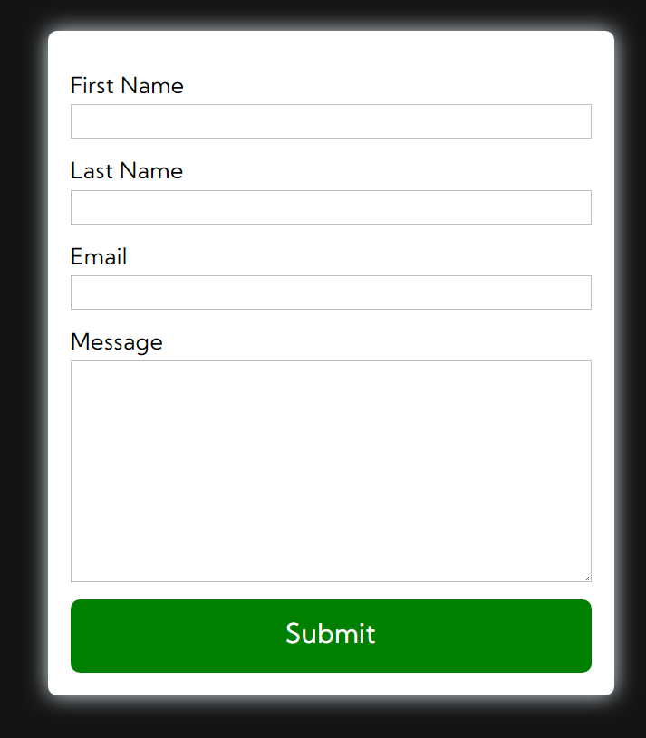
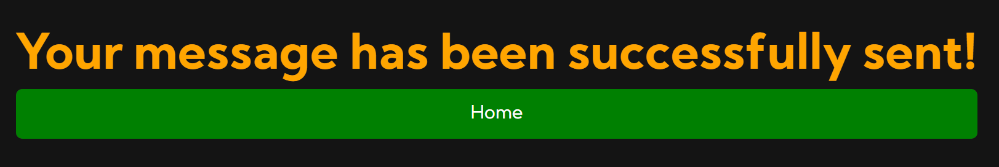
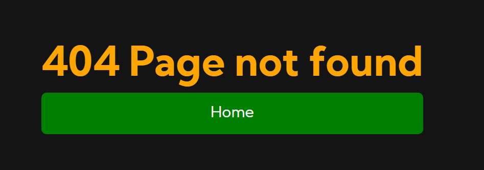

# My Portfolio

My Portfolio is a website that shows my resume in a more interactive way that is accessible to wider audience. 

This site will be target future employers, that are interested in me for any position that I might apply in the future.

## Features 

### Existing Features

- __Navigation Bar__

  - Featured on all three pages and download button, the full responsive navigation bar includes links Home page, About, Contact and Download the CV page and is identical in each page to allow for easy navigation.
  - This section will allow the user to easily navigate from page to page across all devices without having to revert back to the previous page via the ‘back’ button. 

- __Home page__

  - The home page gives a breaf introduction of myself, my current position and responsibilities. 
  - Additionally there's a photo of myself, so the possible recruiters have a visual representation of who they might hire, as well as a button to proceed forward to see my resume.

- __The Footer__ 

  - The footer section includes links to the relevant social media sites to either contact me or see my work. The links will open to a new tab to allow easy navigation for the user. 
  - The footer is valuable to the user as it encourages them to keep connected via social media such as telegram or LinkedIn.

- __About page__

  - The about section will provide the user with additional information such as my work experience and education.
  - This section is valuable to the user as they will be able to easily see in an intercative way what were my acomplishements.

- __Contact page__

  - This page will allow the user to get in touch with me by sending a direct message to my email inbox.  

- __Success page__

  - This page will notify the user that his or her message was successfuly delivered.  

- __404 page__

  - This page will notify the user that the page he was looking for is missing or does not exist.  

### Features Left to Implement

- In the future, there is a plan to implement a calendar (such as calendly or similar) where potential recruiters can schedule a meeting or see when I am available for a meeting.

## Testing 

### Validator Testing 

- HTML
  - No errors were returned when passing through the official [W3C validator]()
- CSS
  - No errors were found when passing through the official [(Jigsaw) validator]()

### Unfixed Bugs

-----

## Deployment

I've deployed My portfolio website on GitHub pages.

These were the steps I used to deploy my website: 
  - In the GitHub repository, navigate to the Settings tab 
  - Select Pages in the left handside menu
  - From the source section drop-down menu, select the main branch and root folder
  - Once the main branch and root folder have been selected, the page will be automatically refreshed with a detailed ribbon display to indicate the successful deployment. 

The live link can be found here - https://artemigo.github.io/portfolio-project-1/index.html

## Credits 

### Content 

- The text for the Home page was taken from [Google fonts](https://fonts.google.com/specimen/Kumbh+Sans)
- The icons in the footer were taken from [Font Awesome](https://fontawesome.com/)
- Instructions on how to implement @media were taken from [FreeCodeCamp](https://www.freecodecamp.org/news/css-media-queries-breakpoints-media-types-standard-resolutions-and-more/)
- Parts of code for cards for the about page taken from [Codepen](https://codepen.io/arti2002/pen/LYRxeOG)
- Instructions for CSS were taken from [W3Schools](https://www.w3schools.com/css/)

### Media

- The photo used on the home page is made by me
- The images used for the about page were taken from:
[Covalen logo](https://covalensolutions.com/img/graphics/logo-grey.svg),
[UCD logo](https://www.ucd.ie/professionalacademy/assets/images/design/logo.png),
[CI logo](https://avatars.githubusercontent.com/u/16867170?s=280&v=4),
[Country flags](https://www.worldatlas.com/r/w768/upload/9e/9d/d9/country-flags-green.jpg),
[LaserMaxx logo](https://lazermax.lv/wp-content/uploads/2016/11/lazermax-logo.png)
