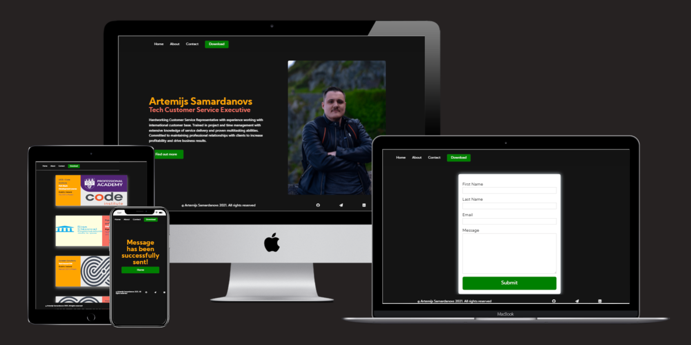
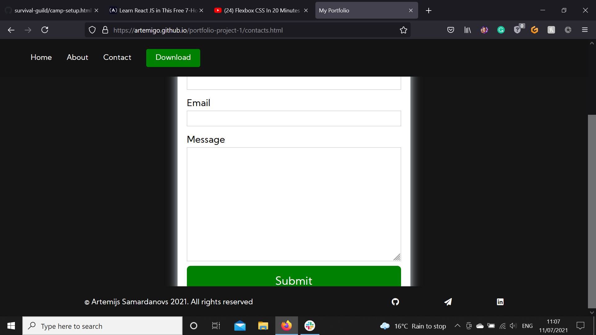
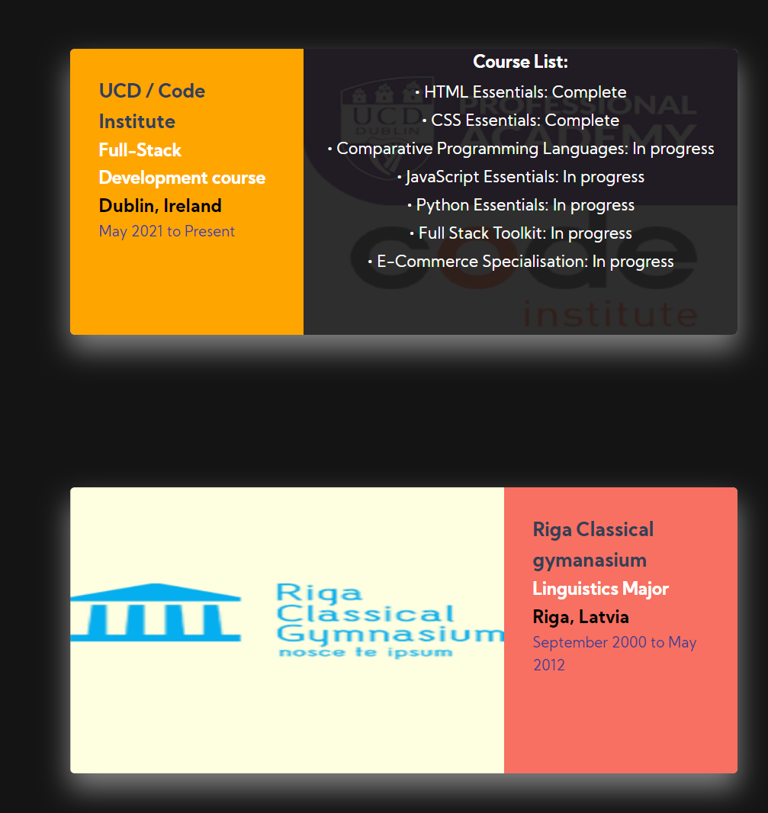

# My Portfolio website

## Milestone Project 1.

My Portfolio is a website that shows my resume in a more interactive way that is accessible to wider audience. 
This site will be target future employers, that are interested in me for any position that I might apply in the future.

This project is for educational purposes and can not be used as a template for a business use.
Main aim is to build responsive website with HTML and CSS only.

## [View my website on github pages](https://artemigo.github.io/portfolio-project-1/index.html)
---

# Table of contents

- [UX](#ux)
    - [Website owner goals](#website-owner-goals)
    - [User goals](#user-goals)
        - [New user goals](#new-user-goals)
        - [Returning user goals](#returning-user-goals)
    - [User stories](#user-stories)
    - [Structure of the website](#structure-of-the-website)
    - [Wireframes](#wireframes)
    - [Surface](#surface)
- [Features](#features)
- [Technology](#technology)
- [Testing](#testing)
    - [Functionality testing](#functionality-testing)
    - [Compatibility testing](#compatibility-testing)
    - [Performance testing](#performance-testing)
    - [Code Validation](#code-validation)
    - [User stories testing](#user-stories-testing)
    - [Issues found during site development](#issues-found-during-site-development)
- [Deployment](#deployment)
- [Credits](#credits)
- [Screenshots](#screenshots)

# UX

## Website owner goals

The main reason to create this website is to help present website owner to potential future employers.
Page owner can present himself, his professional development path, achievements and education and language skills.
Additionally to give potential employers multiple choises on how to contact him via contact form or using social media.
Owner will be able to present an offer himself in an intercative way, which is accessible to wider audience.

## User goals

### New user goals:
- user is able to find information about website owner and learn more about his experience and education.
- user can send a message to me using a contact form.

### Returning user goals:
- user can learn more about my experience and education and see if there are any updates.
- user can send a message to me using a contact form.

## User stories

### As a website owner:
* I would like to present myself and my skillset on the website clearly for potential employers.
* I need to make sure that my current and new customers will find all the information relevant to their search.
* I want for potential employers to be able to download my CV if it's necessary.
* I want my website visitors to be able to learn how to use my website intuitively and easily.

### As a new user:
* I wish to find information about this person and see his qualifications.
* I would like to contact said person for future inquires.
* I want to be able to download this persons CV for future reference. 

### As a returning user:

* I wish to check if there are any changes, such as new skills or education/work experience.
* I would like to get in touch with the website owner (potential future employee)

## Structure of the website

The website is designed to be easy and user-friendy on all type of devices. On desktop, tablet or mobile device there should be no difference for a user to have a fantastic experience. All parts are designed to achieve maximum user satisfaction. User will get some interaction from the interface as links and buttons will have a hover effects.

## Wireframes

I used balsamiq to create a wireframes.

## Surface

### Colors
Main colours used in a project:
* background color: #141414
* background: #131313
* Nav bar link hover color: #f77062
* button background hover: rgb(103, 228, 134)
* button background: green
* Home page h1 color: orane
* Home page h2 color: #f77062
* About page h1 color: #344055
* About page h2 color: darkslateblue
* About page info h2 color: yellow

### Fonts 

* As a main font I used Kumbh Sans, and as a backup font sans-serif

[Back to Table of contents](#table-of-contents)
___
# Features

The website consists of 5 pages. Three are accessible from a navigation menu.
One is a 404 error page and one is a submission confirmation page for a form.
Additionally there is a download button, which opens up download window with my CV attached. 

The website has below features:

## Navigation bar

* #### Navigation bar is visible on the top left of each website page. It is responsive and will adapt to mobile devices by centering itself.

## Footer

* Footer is consistent on all pages. It has copyright info left side and social links on right side.
The footer section includes links to the relevant social media sites to either contact me or see my work. The links will open to a new tab to allow easy navigation for the user. 

## Home

* The home page gives a breaf introduction of myself, my current position and responsibilities. 
Additionally there's a photo of myself, so the possible recruiters have a visual representation of who they might hire, as well as a button to proceed forward to see my resume.

## About

* About me gives information about my work experience, education and language skills.
This section is valuable to the user as they will be able to easily see in an intercative way what were my acomplishements.

## Contact

* Contact form is a main part on this page. User can contact by filling a form to get in contact with me.

##  Future implementations

* In the future, there is a plan to implement a calendar (such as calendly or similar) where potential recruiters can schedule a meeting or see when I am available for a meeting.

[Back to Table of contents](#table-of-contents)
___
# Technologies used

### HTML5
* As a structure language.

### CSS
* As a style language.

### Font Awesome
* As an icon library for a social links.

### Google fonts
* As a font resource.

### GitHub
* As a software hosting platform to keep project in a remote location.

### Git
* As a version-control system tracking.

### Gitpod
* As a development hosting platform.

### Tinypng.com
* As a tool to compess images.

### Paint 3D
* As an image editor.

[Back to Table of contents](#table-of-contents)

___
# Testing

## Functionality testing 

 I used Opera web developer tools and Chrome developer tools throughout the project for testing and solving problems with responsiveness and style issues.

## Compatibility testing
 Site was tested across multiple virtual mobile devices and browsers. I checked all supported devices in both Opera web developer tolls and Chrome developer tools. 
 
 I tested on hardware devices such as: Asus ROG Zephyrus running Kali linux and Windows OS's, Raspberry Pi running Raspbian, Google pixel 2XL Running Android 11.

## Performance testing

I run [Lighthouse](https://developers.google.com/web/tools/lighthouse/) tool to check performance of the website.
Used Ctrl+Shift+N so the test is accurate and no cached data is stored. Screenshot is presented below:

## User stories testing

### As a website owner:

- I would like to present myself and my skillset on the website clearly for potential employers.
    > Name, Surname, current position and a breaf description is given, as well as a whole About page, where users can see more information about the candidate.

- I need to make sure that my current and new customers will find all the information relevant to their search.
    > About page if continuesly being updated as new skills/education or work experience is gained. 

- I want for potential employers to be able to download my CV if it's necessary.
    > Each page has a download button in the Navigation bar, where potential employer can easily download my up to date CV.

- I want my website visitors to be able to learn how to use my website intuitively and easily.
    > Each page has a Navigation bar, where the user can easily return to either home page or to any other. The design is very minimalistic, not to draw attention from the main content and not to overload the user with abundance of information.

### As a new user:
- I wish to find information about this person and see his qualifications.
    > New users visiting Home page, have a my name/surname my current position as well as a breaf description of my duties and responsibilities.

- I would like to contact said person for future inquires.
    > New users can find that they can easily contact me via the contact page form or via the social media links left in the footer on each page of the website. 

- I want to be able to download this persons CV for future reference. 
    > Users visiting the website can easily spot the download button located in the Navigation bar, where the up to date CV is located.

### As a returning customer:
- I wish to check if there are any changes, such as new skills or education/work experience.
    > The Main and About page, as well as CV that is available via the download button is constantly being updated.

- I would like to get in touch with the website owner (potential future employee)
    > Like the new user, returning users have the same options when it comes to contacting me, via the contact form or via the social media links. 

[Back to Table of contents](#table-of-contents)

---
## Issues found during site development

* #### Navbar scaling issues on Iphone 11

Could not reproduce bug where peer reported a bug that the navbar did not scale well on Iphone 11. (The download button was out of the screen)

* #### Footer overlapping contact windows form on laptops.

Peer found a bug, where footer overlapped the contact form.

Made a minor adjustment to the footer container by changing the position from fixed to position:sticky;

## Code Validation
 At the and of the project I used two websites to validate a code
 
 * [W3C CSS Validator](https://jigsaw.w3.org/css-validator/) to validate CSS
    
 * [Nu Html Checker](https://validator.w3.org/) to test HTML
    

[Back to Table of contents](#table-of-contents)

___
# Deployment

I've deployed My portfolio website on GitHub pages.

I used Gitpod and VSCode as a development environment. 

Used Git and GitHub to push changes to the project.

These were the steps I used to deploy my website: 
* In the GitHub repository, navigate to the Settings tab 
* Select Pages in the left handside menu
* From the source section drop-down menu, select the main branch and root folder
* Once the main branch and root folder have been selected, the page will be automatically refreshed with a detailed ribbon display to indicate the successful deployment. 

The live link can be found here - https://artemigo.github.io/portfolio-project-1/index.html

To run localy:
* Log in to GitHub and click on repository to download 
* select Code and click Download the ZIP file.
* after download you can extract the file and use it in your local environment 

[Back to Table of contents](#table-of-contents)
___
# Credits

* To complete this project I used Code Institute student template: [gitpod full template](https://github.com/Code-Institute-Org/gitpod-full-template)

* Ideas and knowledge library:

    * [w3schools.com](https://www.w3schools.com)

    * [css-tricks.com](https://css-tricks.com/)

    * [FreeCodeCamp](https://www.freecodecamp.org/news/css-media-queries-breakpoints-media-types-standard-resolutions-and-more/)

### Code

* About cards: [Codepen](https://codepen.io/arti2002/pen/LYRxeOG)

### Images:

#### The images used for the about page were taken from:

* [Covalen logo](https://covalensolutions.com/img/graphics/logo-grey.svg),

* [UCD logo](https://www.ucd.ie/professionalacademy/assets/images/design/logo.png),

* [Country flags](https://www.worldatlas.com/r/w768/upload/9e/9d/d9/country-flags-green.jpg),

* [LaserMaxx logo](https://lazermax.lv/wp-content/uploads/2016/11/lazermax-logo.png)

* [CI logo](https://avatars.githubusercontent.com/u/16867170?s=280&v=4),

### Websites 

* Mockup website used [Techsini](https://techsini.com/multi-mockup/)

[Back to Table of contents](#table-of-contents)
___

# Screenshots

## Project screenshots

[Back to Table of contents](#table-of-contents)
___
